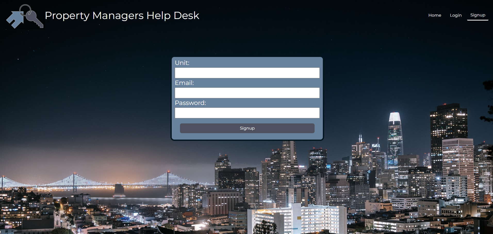

# Property Management Help Desk
Are you a Property Manager? Manage your apartment complex with this ticketing software. Keep your properties running smoothly and your renters happy! 

Deployed at: https://rg-the-help-desk.herokuapp.com/

Repository at: https://github.com/robyng/the-help-desk

### Technologies Used

Front End
* Bootstrap css framework
* AWS for photo uploads
* Custom css

Back End:
* Node.js
* React.js
* MongoDB for database
* GraphQl for testing
* JWT for authentication

### Usage

#### Sign Up
To create your manager account, sign up as Unit 000. This designates you as an admin and let's you manage all your renters and their tickets. 

To create your renter account, sign up as your unit number.

#### Create Ticket
Create tickets with New Ticket link. Give a title to your issue and describe the issue in the message field. Select type of issue. Designate if the issue is private. If it is private, only you and the property manager and see and respond to ticket.

#### Update Ticket Status
The ticket poster and the manager can change the project status of the ticket. All tickets default to Open status. You can change the status of a ticket from In-Progress to Closed or back to Open.

#### Removing Previous Tenants
When a renter moves out the admin can delete the user from the system. Their login will not work after deletion. Logged in as admin, go to Accounts tab and click the Delete button next to the unit that has moved out.
### Questions
Please submit questions to our issues page: https://github.com/robyng/the-help-desk/issues 

### Contributors

David Barron
https://github.com/webgeekbear 

Joe Mogannam
https://github.com/mogannam 

Rafael Cardoso
https://github.com/raf203

Robyn Graham
https://github.com/robyng 

### Credits
Background photo of San Francisco skyline by KEHN HERMANO from Pexels.